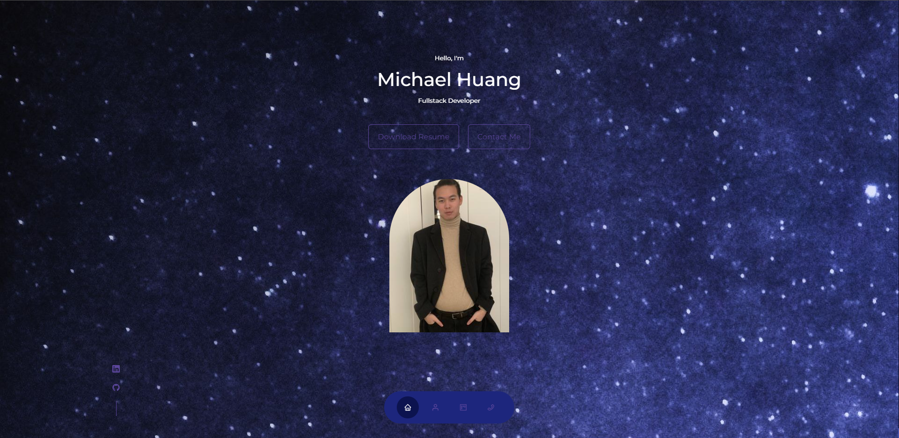
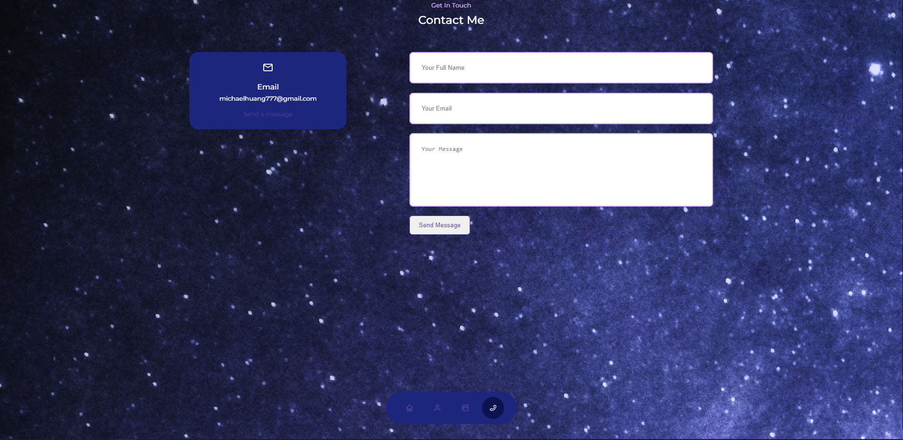

# PORT-robin-son

https://seafoodude.github.io/PORT-robin-son/

## Description

This repository contains my personal portfolio. I used React to build the frontend to my application. With this, users are able to see my personal info, experiences, projects, and contact info.

## Table of Contents

* [Installation](#installation)
* [Usage](#usage)
* [License](#license)
* [Screenshots](#screenshots)
* [Tests](#tests)
* [Contributing](#contributing)
* [Questions](#questions)

## Installation

The user will have to clone the repo, and in gitbash they will need to install all of the packages "npm i" in the root directory. Then the user will have to run "npm run develop" to run the client application. The client runs on port 3000.

## Usage

Once the user has done "npm run develop" the portfolio will spin up on the browser. The user will be able to see my personal information including my resume, contact info, projects, and experiences.

https://seafoodude.github.io/PORT-robin-son/

## License

[License](#license)

This project is licensed under the MIT license.

## Screenshots

## Tests

N/A

## Questions

Github Profile: [seafoodude](https://github.com/seafoodude)
Email: [seafoodude@gmail.com](seafoodude@gmail.com)

## Contributing

Special thanks to Emma, Big Mike, Patricia, Bryan, and Shawn for guiding me through this experience!